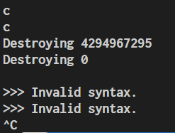
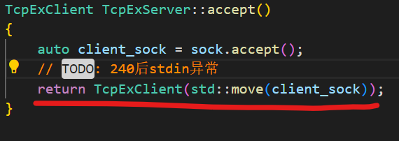
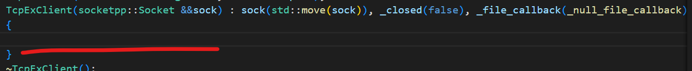
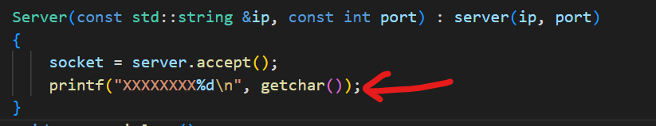
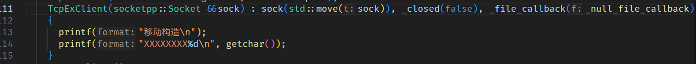

<!-- title: 一次灵异的 BUG 的解决 -->
<!-- date: 2025/05/25 -->
<!-- tag: debug,C++,Linux,IO -->
<!-- desc: 我 accept 了一个连接以后，stdin 居然就 EOF 了？ -->
<!-- license: CC-BY-4.0 -->
# 起因

昨天晚上在 Debian 上随便写了一个简单的网络服务，客户端连接了服务端以后，服务端便会从终端读取用户的命令，并且发送给客户端，然后等待客户端的回应。

一口气写完所有代码以后，我就开始测试。不出意外，果然出 bug 了，在客户端连接上以后，服务端这边的 `std::getline` 就开始一直失败并且返回空字符
串，`std::cin.good()` 也一直是 `false`。



> 实际上从这张图片已经能看出问题所在了，猜猜是哪里出了问题

# 调试

首先想到的 STL 出问题，于是用 `getchar()` 来代替 `std::getline`，结果发现 `getchar()` 也会一直返回 `EOF`。
然后我就开始怀疑是不是 `stdin` 出了问题，怀疑 `stdin` 已经被关闭了。于是我就开始用 `getchar()` 来找到 `stdin` 被关闭的地方，



从这里发现 return 以后 stdin 就被关闭了，怀疑是移动构造函数的问题。



我在这里加了 `getchar()` 以后，发现这里 `getchar` 可以正常的返回。



从这里开始， `getchar()` 就一直返回 `EOF`了。`socket.accapt()` 前面也没有问题。（那里的测试代码截图时删掉了）
之后继续进入到了 `socket.accept()` 函数进行调试，系统函数 `::accept()` 前后也是没有问题的，但是 `socket.accept()`
这个我自己实现的函数在 return 以后，stdin 就开始出问题了。

有人认为可能是编译器的问题，我换 clang 以后，结果还是一样的。

不过从这里开始，问题已经很明确了，一定是某个移动构造函数或者是移动赋值函数出了问题。

我在移动赋值函数和移动构造函数中都加了 `getchar()`，发现移动赋值函数返回的是 `-1`。

```cpp
TcpExClient &operator=(const TcpExClient &) = delete;
TcpExClient &operator=(TcpExClient &&other)
{
    sock = std::move(other.sock);
    _closed = other._closed;
    _file_callback = other._file_callback;
    other._closed = true;
    other._file_callback = _null_file_callback;
    printf("移动赋值 %d\n", getchar());
    return *this;
}

TcpExClient(const std::string &host, const int port);
TcpExClient(socketpp::Socket &&sock) : sock(std::move(sock)), _closed(false), _file_callback(_null_file_callback)
{
    printf("移动构造\n");
    printf("XXXXXXXX%d\n", getchar());
}
```

我在这里加了 `strerror(errno)` 来打印错误信息，发现错误信息是 `Bad file descriptor`。~~我怎么现在才想起来这件事啊~~

# 解决

过了一会，有人告诉我

> 
> 这个移动构造，在没有优化的情况下。默认先构造了一个空的socket，sockfd为0，后来析构掉了。

**这下看懂了**

让我们看看析构函数是怎么写的：

```cpp
void TcpExClient::close()
{
    if (_closed)
    {
        return;
    }

    try
    {
        _send_datapack(TCPEX_TYPE_EXIT, "");
    }
    catch (...)
    {
    }
    sock.close();
}


TcpExClient::~TcpExClient()
{
    close();
}

```

现在还不清楚？那就让我们继续看看 `sock.close()` 的实现：

```cpp
void Socket::close() noexcept
{
    if ((int)sockfd == -1)
    {
        return;
    }
    if (::close(sockfd) == -1)
    {
        std::cerr << "WARNING: close failed: " << std::strerror(errno) << std::endl;
    }
    sockfd = -1;
}

Socket::~Socket()
{
    std::cerr << "Destroying " << sockfd << std::endl;
    Socket::close();
}
```

让我们回顾一下最开始的输出


`4294967295` 是被转换为无符号整数的 `-1`，所以说这里的 `Destroying -1` 被忽略掉了。

但是底下的 `Destroying 0` 就不一样了，这个等于 0 的 sockfd 是被正确的关闭的。 **而这个值为 0 的文件描述符，正是 stdin**。

相当于我们执行了 `::close(0)` ，即 `::close(::fileno(stdin))`！

而这个等于 0 的 sockfd 是哪里出现的呢？

```cpp
Socket::Socket(Socket &&other)
{
    if (this == &other)
    {
        return;
    }

    sockfd = other.sockfd;
    addr = other.addr;
    other.sockfd = 0;
}
```

`Socket::Socket(Socket &&other)` 是一个移动构造函数，它将 `other` 资源转移给 `this`，然后将 `other`
清空。这段代码是 AI 补全的，它把 `other` 的 `sockfd` 设置为 0。于是，这个临时对象 `other` 在析构的时候，
调用了 `::close(0)`。

我把这里改成了 `other.sockfd = -1;` 问题就解决了。

不过，前面的一些调试结果和实际的问题所在不符，这是因为前面使用 `getchar()` 作为调试工具是不好的。
stdin 需要你键入回车才能 flush，但是 `getchar()` 并不会消耗掉 `\n`，所以所有的第偶数个 `getchar()` 都会返回
`\n`，也就是 `10`，无论 stdin 目前是否关闭。（尽管 stdin 关闭了，其实用户缓冲区内还会剩一个 `\n`）
这导致了前面的调试结果存在一定的误导性。

# 总结

Linux 下 IO 的设计是万物皆文件，无论是 regular file, pipe 还是 socket 都可以用 File Descriptor 来表示。
都可以用 `::close()` 来关闭。我这里把 `other.sockfd` 设置为 0，本质上并非清空了 `other` 的 IO 资源占用，而是
将 stdin 的所有权给予了 `other`。

在平时写代码的时候，一定要注意辨析 0 和 -1 的区别，0 是一个有效的文件描述符，而 -1 是无效的。
但是其它的资源就不一定了，比如 `malloc` 返回的错误值是 `0`，而 `iconv_open` 返回的错误值则是 `-1`。

在调用某个 API 之前，一定先要明确它的正常返回值，错误返回值和空值的区别。搞清楚哪个是 0，哪个是 -1。

<terminal-applet title="模拟" rows="15" columns="80" src="res/2025-05-25-0/example.js"
    id="example" read-only="false">
</terminal-applet>
